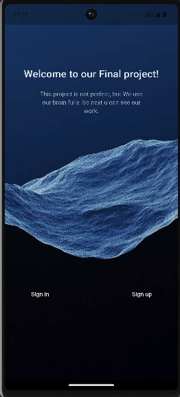
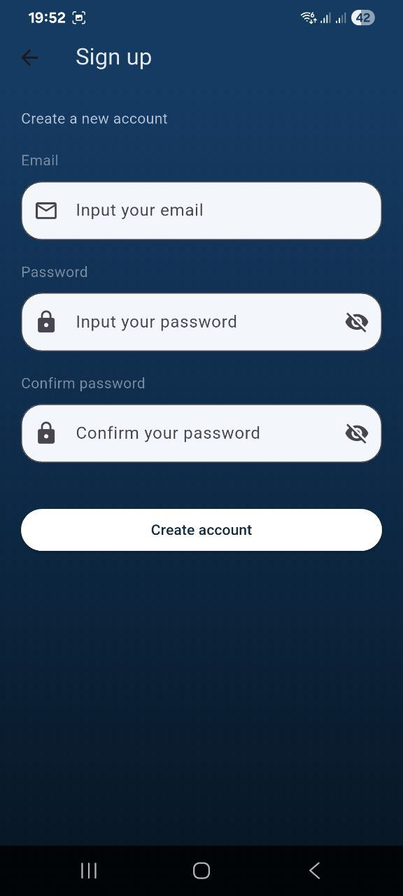
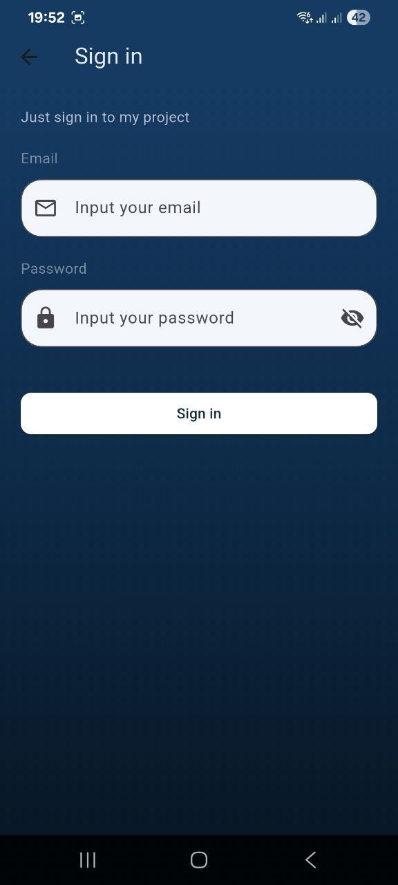
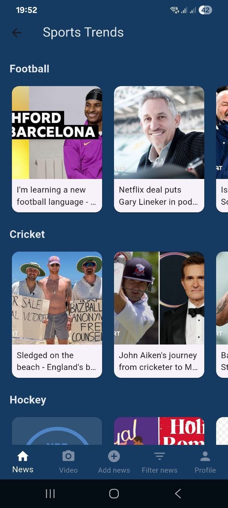
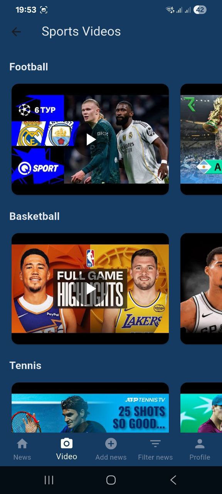
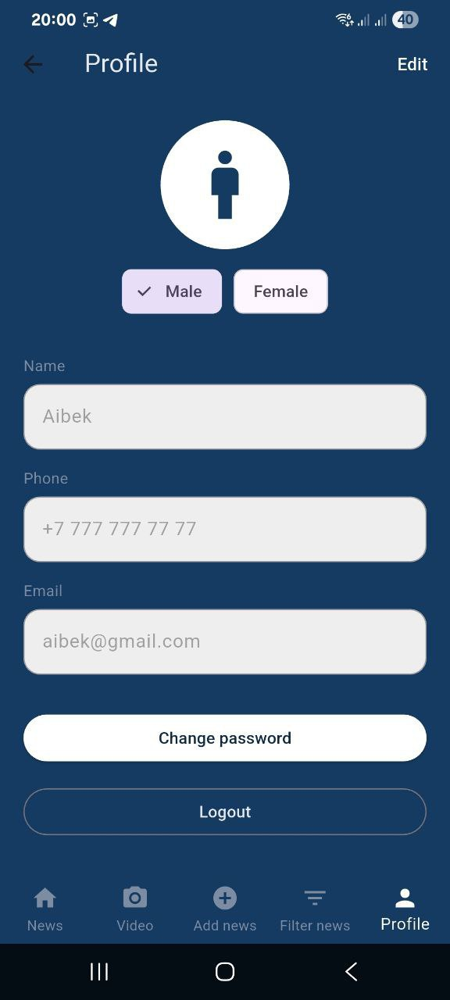

## Team:

Baizhuma Aibek and Narbayev Danial

## Project:
Sport Trends: This is a mobile app for people interested in and passionate about sports.

## Goal:
To create an effective and simple way to stay up-to-date with the news, find only what interests them, and always stay on top of the latest developments. This is not only for dedicated fans, but also for those who have recently become interested in sports and want to learn even more.

## Features:
1) Registration and Login
2) Viewing Sports News
3) Viewing Highlights and Videos
4) News Filtering
5) Adding Categories
6) User Profile (Logout and Editing)
7) Convenient Bottom Navigation, etc.

## Backend:
We used Firebase for login/registration, which ensures users can log in and out securely, increasing reliability.

## What our app offers:
Everything you need to stay up-to-date on your favorite sport, gathered in one place.

## screenshots

  
  
  

  
  

  
  
  

## Platform:
Android
IOS

## Conclusion:
Sports Trends is a mobile app that makes sports news and videos easy and convenient to browse. All relevant content is gathered in one place, and users can customize the feed to suit their interests
This project uses Flutter for cross-platform development and Firebase for secure authentication. The project's goals were achieved: it visually demonstrates practical mobile app development skills, working with backend services, and effective team collaboration
